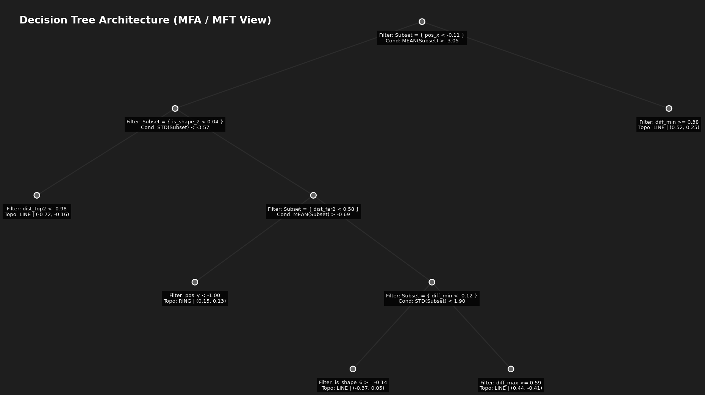

# 🚇 SpatialTreeRL: Decision-Tree Policy Optimization for Mini Metro

**SpatialTreeRL** 是一個結合「決策樹邏輯」與「近端策略最佳化 (PPO)」的新型強化學習架構。
本專案以動態交通路線規劃遊戲《Mini Metro》為測試環境，捨棄了傳統的扁平黑盒子神經網路，將 Agent 的決策過程拆解為 **特徵過濾 (Filtration) → 拓撲生成 (Topology Construction)**。這讓模型能夠學會根據車站形狀與乘客密度，建構出高效、且具備高度解釋性的交通網路拓撲。

## 🧠 核心架構 (Core Architecture)

<p align="center">
  
</p>

本專案捨棄了傳統的扁平黑盒子神經網路，將 Policy 拆解為具備高度可解釋性的 **MFA (Mapping → Filtration → Aggregation)** 以及 **MFT (Mapping → Filtration → Topology)** 空間決策樹管線：

1. **Mapping (空間映射)**：將車站的動態實體狀態（座標、類型、乘客堆積數）轉換為連續的空間特徵向量。
2. **Filtration (特徵過濾)**：透過決策樹節點（Node），根據空間條件動態篩選出特定的車站子集（例如：高負載車站、特定幾何形狀節點）。
3. **Aggregation (空間聚合)**：將過濾後的車站子集特徵進行池化（Pooling）或加權聚合，提煉出全域或區域性的宏觀環境指標，供 Critic 網路進行價值評估。
3. **Topology (拓撲生成)**：由葉子節點（Leaf）驅動，針對過濾後的車站子集進行邏輯線路連通，最終在環境中建構出實體地鐵網路。


## 🚀 成果展示 (Demo)

*左圖為未經訓練的基礎策略，右圖為 PPO 訓練後的決策樹策略。展示了相同隨機地圖 (Seed=5) 下的存活表現差異。*

| 基準策略 (Dumb Ring Baseline) | 訓練後策略 (Trained SpatialTreeRL) |
|:---:|:---:|
|  |  |
| *無差別將所有車站連成單一環線，導致效率極低、車站迅速過載崩潰。* | *精準辨識特殊車站與擁擠節點，動態建構出高效率的星狀或交匯拓撲，大幅延長存活時間。* |


## ⚙️ 執行環境與指令

本專案已完全容器化 (Dockerized)，確保實驗具備 100% 的可重現性 (Reproducibility)。請確保已安裝 Docker，並使用以下 `docker compose` 指令執行。

### 1. 訓練模型 (Training)
啟動 PPO 訓練管線。訓練過程中的權重 (Checkpoints) 與日誌將會自動保存在 `checkpoints/` 資料夾中。
```bash
docker compose run --rm metro-gpu-test python src/train.py

```

### 2. 錄製模型遊玩影片 (Trained Agent Timelapse)

載入訓練好的神經網路權重，並渲染高倍速的遊戲過程影片（存於 `outputs/` 目錄）。你可以透過參數自訂模型路徑、隨機種子與播放倍速。

```bash
docker compose run --rm metro-gpu-test python src/timelapse.py --model policy_ep_1000.pth --seed 5 --speedup 30

```

### 3. 錄製基準策略影片 (Baseline Timelapse)

使用預設的「傻瓜環線 (Dumb Ring)」邏輯進行遊戲並錄影，作為對照組。

> **💡 提示：** 強烈建議使用與步驟 2 相同的 `--seed` 參數，這樣才能確保兩支影片的車站出現順序完全一致，達到最佳的對比效果。

```bash
docker compose run --rm metro-gpu-test python src/timelapse_baseline.py --seed 5 --speedup 30

```